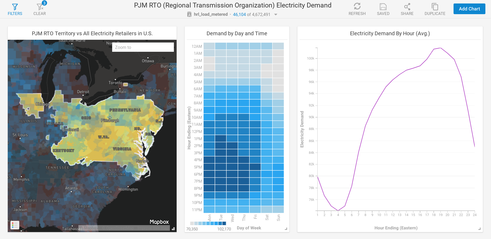

# End to End Data Science Without Leaving the GPU

Source materials from Randy Zwitch 'End to End Data Science Without Leaving the GPU' talk at PyData NYC 2018

## Build Environment

In order to get all of the packages working in harmony, I built libGDF/pygdf from source, after building pymapd. I've included the [conda environment file](https://github.com/omnisci/pydatanyc2018/blob/master/spec-file.txt). 

`conda create --name pydatanyc2018 --file spec-file.txt`

For your best chance at replicating this build environment, using Docker with Ubuntu 16.04 and nvidia-docker2 might be your best bet.

## Data

I've included the PJM RTO data created by the `df` query in cell 3. So to follow along, you could import the example data (exampledata.csv.gz) to pandas, then run the code examples below that query step.
